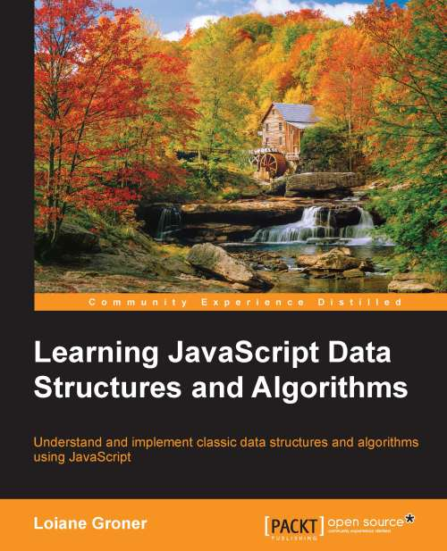

# Learning JavaScript Data Structures and Algorithms
  

## info  
* [publihser](https://www.packtpub.com/application-development/learning-javascript-data-structures-and-algorithms)  

## toc  
* [Ch01 JavaScript_A Quick Overview](Ch01_JavaScript_A_Quick_Overview.md)
* [Ch02 Arrays](Ch02_Arrays.md)
* [Ch03 Stacks](Ch03_Stacks.md)
* [Ch04 Queues](Ch04_Queues.md)
* [Ch05 Linked Lists](Ch05_Linked_Lists.md)
* [Ch06 Sets](Ch06_Sets.md)
* [Ch07 Dictionaries and Hashes](Ch07_Dictionaries_and_Hashes.md)
* [Ch08 Trees](Ch08_Trees.md)
* [Ch09 Graphs](Ch09_Graphs.md)
* [Ch10 Sorting and Searching Algorithms](Ch10_Sorting_and_Searching_Algorithms.md)
* [Appendix A Index](Ch11_Suppliment.md)